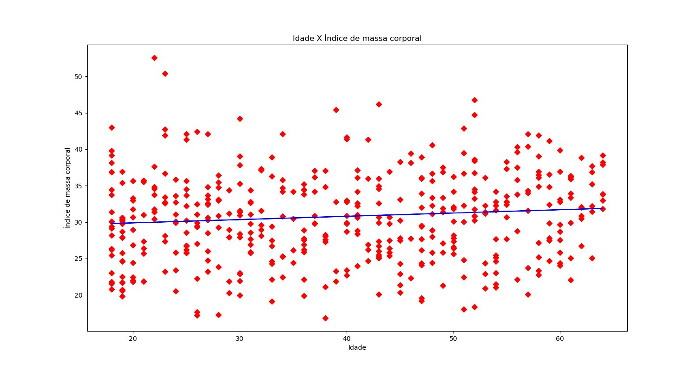

<h1 align="center" id="title">Linear Regression Data Science ML / IA</h1>

Neste projeto, embarcamos em uma jornada fascinante para explorar os domínios da regressão linear utilizando as poderosas ferramentas fornecidas pelo scikit-learn, uma biblioteca amplamente valorizada por entusiastas de inteligência artificial e aprendizado de máquina. Com um conjunto de dados repleto de potenciais insights, nos aprofundamos na tarefa de comparar duas variáveis essenciais.
  
Utilizando funções robustas como `LinearRegression()` e `train_test_split()`, conduzimos uma análise de dados meticulosa, buscando padrões e correlações que pudessem iluminar nosso entendimento. A cada iteração, nos aproximamos mais de desvendar os segredos escondidos dentro dos dados, guiados pela curiosidade e pela precisão dos algoritmos de aprendizado de máquina.
  
Ao analisar o gráfico gerado, é possível perceber uma distinção significativa entre idade e índice de massa corporal (IMC). A linha de regressão, que cruza o gráfico, demonstra a relação entre essas duas variáveis. No entanto, essa relação é fraca, indicando que a maioria das pessoas possui um IMC acima ou abaixo do padrão recomendado para suas respectivas idades. Apenas uma minoria se encontra dentro da faixa considerada ideal. Esta análise sugere que há uma variação considerável no IMC em relação à idade, destacando a necessidade de mais investigações sobre os fatores que influenciam essa discrepância.

<h2>Project Screenshots:</h2>

  
  
<h2>💻 Built with</h2>

Technologies used in the project:

*   Sckit-learn
*   pandas
*   python
*   matplotlib
*   Jupyter Notebook
